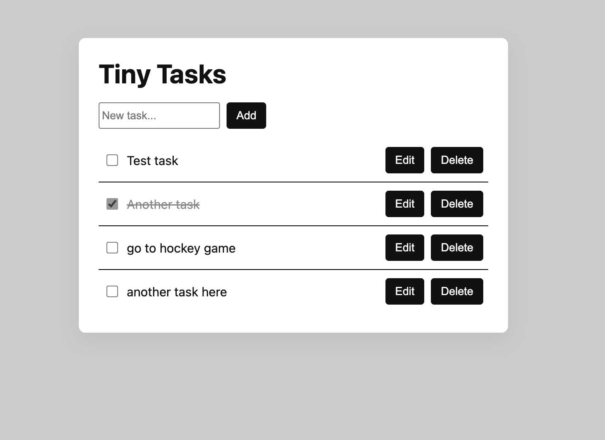

# Tiny Tasks – Frontend

React frontend for the Tiny Tasks app.  
This project focuses on clean UI state handling and consuming a REST API (loading/error/empty states, CRUD actions, and readable code structure).

## Live Demo
https://tiny-tasks-rainer.netlify.app/

## Screenshot

---

## Tech Stack
- React (Vite)
- JavaScript
- Fetch API
- Sass
- Netlify (deployment)

---

## Features
- View all tasks
- Create a task
- Edit task title (PATCH)
- Delete a task (optimistic UI)
- Loading, error, and empty states
- API logic extracted into a small helper (`src/api/tasks.js`)

---

## Getting Started

Prerequisites
- Node.js 18+
- The backend API running locally

## Installation
git clone https://github.com/YOUR_USERNAME/tiny-tasks-frontend.git
cd tiny-tasks-frontend
npm install

## Run the App
npm run dev

Vite will start the app at:
http://localhost:5173

## Backend Dependency
http://localhost:3000

## Design Decisions

- **API helper layer (`src/api/tasks.js`):** Keeps components focused on UI/state while centralizing request + error handling.
- **Optimistic UI for deletes/toggles:** Improves perceived speed; rolls back state if the request fails.
- **Backend as source of truth:** After create/update, tasks are re-fetched to avoid client/server drift.
- **Simple state model:** Uses React state + effects (no extra libraries) to keep the project easy to read and maintain.
